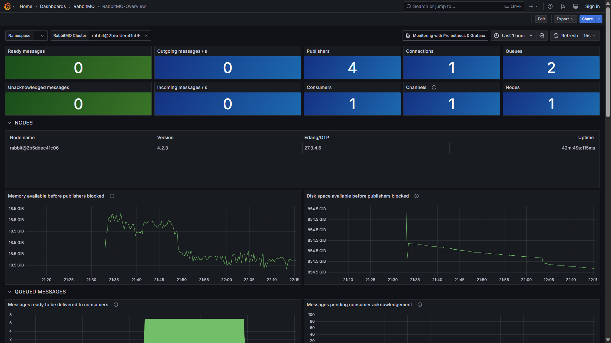
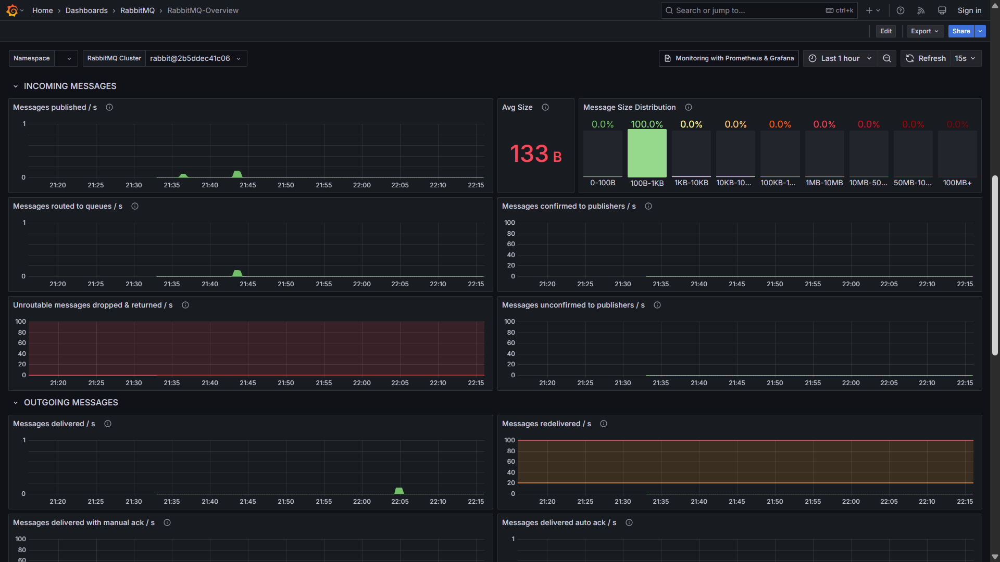
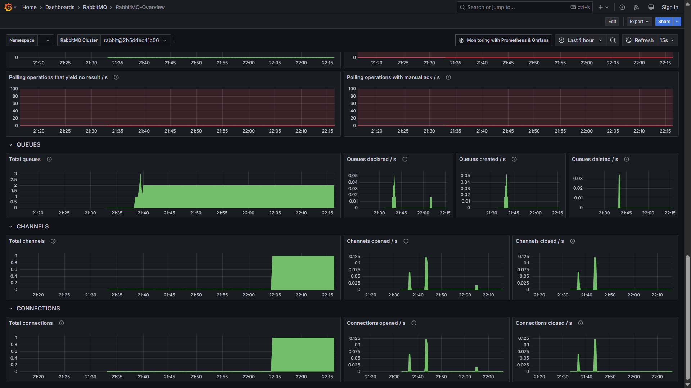

# dockercompose-grafana-prometheus-alloy-loki-tempo-rabbitmq
Scripts do Docker Compose para subida de ambiente baseado na stack Grafana (dashboards + Prometheus + Allow/OpenTelemetry + Loki + Tempo) e para testes com mensageria utilizando RabbitMQ. Inclui dashboard de monitoramento da instância do RabbitMQ.

Dashboard para monitoramento de instâncias do RabbitMQ disponibilizado pelo time da Grafana Labs: **https://grafana.com/grafana/dashboards/10991-rabbitmq-overview/**

Alguns insights oferecidos por este dashboard:

